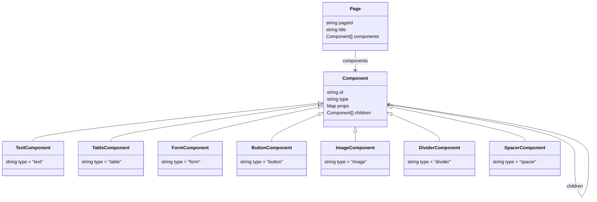

# 🧱 Technical Requirements Document: Config-Driven Page Builder

## 1. 🌟 Purpose

Build a system that renders dynamic web pages based on JSON configuration objects. Each configuration corresponds to one unique, accessible page (e.g., `/marketing-landing`). These pages can showcase data from APIs and collect user inputs using predefined UI components.

---

## 2. 📀 High-Level Architecture

```text
[ User ] <-- Browser -->
   |
   v
[ Frontend Web App (React/Next.js) ]
   |
   v
[ Config API Service ] <---> [ Config Database (MySQL JSONB) ]
   |
   v
[ External/Backend APIs ] (for form/table integration)
```

---

## 3. ⚙️ Core Entities

### 3.1 `Page`

| Field        | Type   | Description                  |
| ------------ | ------ | ---------------------------- |
| `pageId`     | string | URL path (e.g., "signup")    |
| `title`      | string | Page title                   |
| `components` | array  | List of top-level components |

---

### 3.2 `Component`

| Field      | Type   | Description                                                                  |
| ---------- | ------ | ---------------------------------------------------------------------------- |
| `id`       | string | Unique ID of component                                                       |
| `type`     | enum   | `text`, `form`, `table`, `button`, `image`, `divider`, `spacer`, `container` |
| `props`    | object | Props specific to the component type                                         |
| `children` | array? | Optional for containers                                                      |

---

### 3.3 Leaf Components (`type` = value)

#### `text`

```json
{
  "type": "text",
  "props": {
    "value": "Welcome to our page!",
    "style": { "fontSize": "lg", "fontWeight": "bold" }
  }
}
```

#### `form`

```json
{
  "type": "form",
  "props": {
    "fields": [
      { "id": "email", "label": "Email", "type": "email", "required": true }
    ],
    "submit": {
      "label": "Subscribe",
      "api": {
        "method": "POST",
        "url": "/api/subscribe",
        "payloadMapping": { "email": "email" }
      }
    }
  }
}
```

#### `table`

```json
{
  "type": "table",
  "props": {
    "columns": [
      { "label": "Name", "field": "name" },
      { "label": "Email", "field": "email" }
    ],
    "api": {
      "method": "GET",
      "url": "/api/users"
    }
  }
}
```

#### `button`

```json
{
  "type": "button",
  "props": {
    "label": "Click Me",
    "onClick": {
      "api": {
        "method": "POST",
        "url": "/api/button-action"
      }
    }
  }
}
```

---

## 4. 🧹 System Components

### 4.1 Frontend (React + Next.js)

- Fetch config from backend by page ID (`/api/page-config/:pageId`)
- Render component tree recursively
- Use a central `ComponentRenderer` to switch on `type`
- Support dynamic routing: `[pageId].tsx`
- Handle form submissions & data loading from APIs
- Basic error and loading states

### 4.2 Backend API Service

- REST endpoint: `GET /api/page-config/:pageId`
- Serve page config JSON stored in DB
- Support for `POST /api/admin/page-config` (optional, for authors)
- Validate config structure before storing

### 4.3 Database (MySQL)

\*\*Table: \*\***`page_configs`**

| Column        | Type      | Description             |
| ------------- | --------- | ----------------------- |
| `id`          | UUID      | Primary key             |
| `page_id`     | TEXT      | Route identifier        |
| `title`       | TEXT      | Page title              |
| `config_json` | JSONB     | Page configuration JSON |
| `created_at`  | TIMESTAMP |                         |
| `updated_at`  | TIMESTAMP |                         |

---

## 5. 🥪 Rendering Flow (Frontend)

1. Parse `pageId` from the URL
2. Call `GET /api/page-config/:pageId`
3. Render page layout using `components[]`
4. For each component:
   - If `type = container`, recursively render children
   - If `type = form`, handle validation and submission
   - If `type = table`, fetch and show tabular data
   - If `type = button`, bind `onClick` to API call

---

## 7. 🔒 Non-Functional Requirements

- Configs are stored persistently in DB
- All components render responsively
- Safe input/output handling in forms
- Allow updates to config without rebuilding frontend

---

## 8. 🧐 Future Enhancements (Out of Scope for Now)

- Conditional logic (show/hide based on inputs)
- Config versioning & rollback
- Auth-based access control
- Visual Config Builder (GUI)
- Analytics or A/B testing

---

## 9. ✅ Acceptance Criteria

| Feature              | Requirement                                |
| -------------------- | ------------------------------------------ |
| Config fetch         | `/api/page-config/:pageId` returns JSON    |
| Dynamic routing      | Visiting `/marketing-landing` renders page |
| Component rendering  | All component types are supported          |
| Form handling        | Submits mapped payloads to API             |
| Table rendering      | Fetches and displays remote data           |
| Extensible structure | New components can be added easily         |

---

## 11. 📌 Appendix

### 11.1 Mermaid Class Diagram


